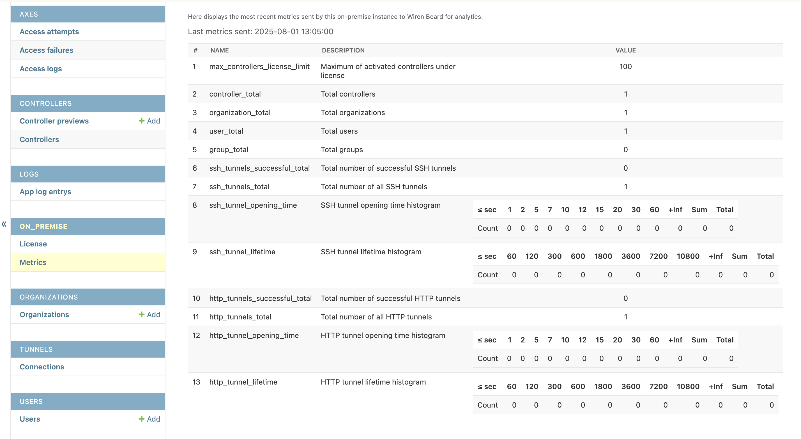

# Wiren Board Cloud On-Premise


> ⚠️ Используя этот репозиторий или загружая Docker образы, вы принимаете условия лицензионного соглашения (LICENSE файл).

---

## 📖 Описание

Документация по настройке и развертыванию облака Wiren Board в On-Premise окружении.

### Минимальные системные требования:
- OS: Linux(Ubuntu 24)
- CPU: 2 Cores
- RAM: 6GB
- HDD: 20GB

### Рекомендуемые системные требования:

- OS: Linux(Ubuntu 24)
- CPU: 4 Cores
- RAM: 8GB
- HDD: 40GB

> ⚠️ Необходимо, чтобы процессор или гипервизор вашей ВМ поддерживал инструкцию `x86-64-v2`. При использовании виртуальной машины может потребоваться параметр `host-passthrough` (или `CPU=host`).

### Особенности версии On-Premise

Основные отличия локального облака от нашего [wirenboard.cloud](https://wirenboard.cloud) связаны с обеспечением безопасности инстанса и уменьшением нагрузки на сервер.

#### Регистрация пользователей и демодоступ

В On-Premise:
- новый пользователь не сможет зарегистрироваться без приглашения от владельца или админа организации;
- нет кнопки «Демо-аккаунт».

#### Метрики

Пока доступна только бесплатная версия на 100 контроллеров, которую можно использовать в личных и коммерческих целях. В этой версии включена обязательная отправка обезличенных метрик к нам на сервер, что именно отправляется смотрите в бэкенде инстанса «On Premise» → «Metrics».

Если ваш инстанс не сможет достучаться до нашего сервера сбора метрик [metrics.wirenboard.cloud](https://on-premise-metrics.wirenboard.cloud), облако будет работать, но вы не сможете добавлять контроллеры.

В будущем будут платные тарифы где можно отключить отправку метрик и добавить больше контроллеров.

Отправляемые метрики, скриншот из бэкенда инстанса On-Premise:


---

## ⚙️ Предварительная настройка

Перед развертыванием приложения должны быть выполнены следующие шаги:

### 1. DNS-записи

Должны быть настроены следующие DNS-записи типа A:

```text
@.your-domain.com
*.your-domain.com
```

Они покрывают все следующие поддомены необходимые для работы сервиса:

```text
metrics.your-domain.com
influx.your-domain.com
tunnel.your-domain.com
app.your-domain.com
agent.your-domain.com
ssh.your-domain.com
http.your-domain.com
*.ssh.your-domain.com
*.http.your-domain.com
```

### 2. Порты

Для работы облака необходимо, чтобы у вас были открыты следующие порты:

- `443` - для облака
- `7107` - для туннелей
- `7501` - для доступа к дашборду туннелей (Опционально)

> ⚠️ Если у вас уже заняты какие-то из этих портов вы можете переопределить их в `.env` файле.

> Если `443` порт уже занят другим веб-сервером, см. [Использование с другим веб-сервером](#-использование-с-внешним-веб-сервером-nginxapachecaddy)


### 3. DNS-записи для почты

Должны быть настроены MX, SPF, DKIM и DMARC записи для корректной отправки email.
Это необходимо для отправки электронных писем с приглашением в организацию, сброса пароля и тд.

### 4. Сертификаты TLS

Сертификат должен быть выдан доверенным CA:
- Let's Encrypt (DNS challenge)
- Коммерческие CA (Sectigo, DigiCert и др.)

> ❌ Самоподписанные сертификаты не поддерживаются.

Если у вас есть сертификат для этого домена, то проверьте его SAN (перечень поддоменов):

```bash
openssl x509 -in "path/to/your/certs/fullchain.pem" -noout -text | grep -A1 "Subject Alternative Name"
```

Сертификат должен включать:

```text
your-domain.com
*.your-domain.com
*.http.your-domain.com
*.ssh.your-domain.com
```

В противном случае вам придется получить новый.

---

Разместите полученные `fullchain.pem` и `privkey.pem` в `./tls` или настройте переменную окружения `TLS_CERTS_PATH`.

Пример получения сертификата при помощи `Certbot`, см. [Пример ручной настройки Wildcard сертификатов](#-пример-ручной-настройки-wildcard-сертификатов)

---

## 🚀 Развертывание приложения

> Для запуска вам понадобится `docker compose v1.21.0` и выше.

### 1. Настройка переменных окружения

Создайте копию файла окружения:

```bash
cp .env.example .env
nano .env
```

Заполните все обязательные переменные как в примере ниже:

```dotenv
ABSOLUTE_SERVER=my-domain-name.com

# Настройка отправки email
# Установите smtp+ssl если используете SSL
EMAIL_PROTOCOL=smtp+tls
EMAIL_LOGIN=mymail@mail.com
EMAIL_PASSWORD=password
EMAIL_SERVER=smtp.mail.com
EMAIL_PORT=587
EMAIL_NOTIFICATIONS_FROM=mymail@mail.com

# Создание администратора
ADMIN_EMAIL=admin@mail.com
ADMIN_USERNAME=admin
ADMIN_PASSWORD=password

# Создание администратора InfluxDB
INFLUXDB_USERNAME=influx_admin
INFLUXDB_PASSWORD=influx_password

# Создание администратора Tunnel Dashboard и настройка порта
TUNNEL_DASHBOARD_USER=tunnel_admin
TUNNEL_DASHBOARD_PASSWORD=tunnel_password
TUNNEL_DASHBOARD_PORT=7501

# Настройка порта для работы тоннелей. Измените если порт уже занят
TUNNEL_PORT=7107

# Создание администратора Postgres
POSTGRES_DB=db_name
POSTGRES_USER=postgres_user
POSTGRES_PASSWORD=postgres_password

#--------------------------------------------------------------------------
# Optional ----------------------------------------------------------------
#--------------------------------------------------------------------------

# Создание администратора Minio
#MINIO_ROOT_USER=minio_admin
#MINIO_ROOT_PASSWORD=minio_password

# Установить имя докер сети если требуется. По умолчанию "wb-net"
#DOCKER_NET_NAME=my-docker-network

# Установить путь к директории с tls сертификатами если требуется. По умолчанию "./tls"
#TLS_CERTS_PATH=path/to/my/certs/

# Установить внешний порт для Traefik
#TRAEFIK_EXTERNAL_PORT="127.0.0.1:8443

```

> ⚠️ **Переменная `EMAIL_URL` генерируется автоматически.**  
> Она собирается из переменных `EMAIL_PROTOCOL`, `EMAIL_LOGIN`, `EMAIL_PASSWORD`, `EMAIL_HOST`, `EMAIL_PORT` и др.  
> Изменили одну из этих переменных — **обязательно** выполните `make generate-email-url` или `make run` при запуске.  
> Это пересоберёт `EMAIL_URL` и применит новые настройки.  
> Запуск `docker compose up` без предварительного `make run` или `make generate-email-url` оставит старое значение.


Установите пакет `make`, если он ещё не установлен:

```bash
apt install make
```

Выполните команду, которая сгенерирует все необходимые секретные ключи и токены и запустит проект:

```bash
make run
```

✅ Поздравляем! Ваше облако готово к работе.

---

## ▶️ Использование

### Регистрация пользователей

В on-premise облаке регистрация сторонних пользователей отключена.
Доступ к системе изначально имеет только один пользователь с правами администратора,
чьи логин и пароль берутся из переменных окружения `ADMIN_USERNAME` и `ADMIN_PASSWORD` при запуске проекта.

> ⚠️ Вы можете сменить пароль в любое время и создать другого администратора,
> но имейте в виду, что, если вы удалите пользователя,
> который указан в переменных окружения, он создаться снова при перезапуске проекта.

Создание первой организации осуществляется администратором вручную.

Добавление новых пользователей возможно только через административную панель или посредством отправки приглашения на электронную почту.

После получения приглашения пользователь может перейти по ссылке в письме и зарегистрироваться.


### Настройка контроллера

Для настройки контроллера на работу с вашим on-premises облаком, необходимо выполнить следующие шаги:

#### 1. Добавить провайдера облака

##### В новых релизах начиная с wb-2507 и testing (агент > 1.5.14)

```bash
wb-cloud-agent use-on-premise https://your-domain.com
```

> После того как your-domain.com будет доступен в сети, команда `wb-cloud-agent` выведет активационную ссылку по которой можно будет связать контроллер с вашим облаком.

##### В старых релизах до wb-2504 включительно (агент <= 1.5.14)

Зайти в консоль самого контроллера и выполнить следующую команду:
```bash
wb-cloud-agent add-provider your-onpremise-name https://your-domain.com/ https://your-domain.com/api-agent/v1/
```
где:
- `your-onpremise-name` - название провайдера (можно задать любое)
- `https://your-domain.com/` - адрес облака
- `https://your-domain.com/api-agent/v1/` - адрес агента облака. Адрес всегда будет: `адрес облака` + `/api-agent/v1/`

> После того как your-domain.com будет доступен в сети, перейдите в web ui контроллера в раздел `Настройки -> Система` и перейдите по активационной ссылке с помощью которой можно связать контроллер с вашим облаком.
> 
#### 2. Привязать контроллер к пользователю

Перейдите в веб-интерфейс контроллера, выберите:

`Настройки` -> `Система` -> `Подключение к облаку (your-onpremise-name)`

> Если вы не видите в настройках пункт `Система`, значит у вас нет прав администратора.
>
> Перейдите в `Настройки` -> `Права доступа` и выберите пункт `Администратор` -> `Я принимаю всю ответственность...` -> `Применить`
>
> После этого пункт `Система` появится в меню.

Перейдите по ссылке, авторизуйтесь в облаке и выберите организацию, куда хотите добавить контроллер.

Ваш контроллер успешно привязан к облаку.

---

## 🎛️ Переменные окружения

Вы так же можете указать некоторые переменные окружения вручную,
и тогда при запуске генерация указанных переменных будут пропущена.

Пример заполнения доступных переменных окружения:

```dotenv

# Токен для открытия тоннелей
TUNNEL_AUTH_TOKEN=GLgTbKtCiwF8J4tI439NJba0pbXfW0a39E7jZOOr0qO67xonhhfaNIWiH7FzPP

# Токен для доступа к Influx
INFLUXDB_TOKEN=PvxahJmIuieFy1ieODoQ3JpKEVSCDSkRUQZjjePSlajJV6w1Sl2iAQcpY8f2z4s

# Секретный ключ для Django
SECRET_KEY=40h0EtROD1krOPzZ/PSiCgnZgbOc+x0omKJrpzH9JDDbwXBTf4

```

Если вы хотите использовать свои приватный и публичные ключи для JWT,
пометите файлы `private.pem` и `public.pem` в директорию `jwt` в корне проекта
или они будут сгенерированы автоматически.

---

## 📦 Управление проектом через Makefile

Для работы с on-premise облаком используется набор команд Makefile.
Все действия выполняются из корня репозитория. Перед первым запуском убедитесь, что у вас установлен Docker Compose и утилита make.

### Основные команды

| Команда                   | Описание                                                                       |
|---------------------------|--------------------------------------------------------------------------------|
| `make help`               | Показать справку по всем доступным командам                                    |
| `make check-env`          | Проверить наличие всех обязательных переменных окружения в `.env`              |
| `make check-certs`        | Проверить наличие и валидность сертификатов                                    |
| `make generate-env`       | Сгенерировать недостающие токены и секреты, заполнить переменные в `.env`      |
| `make generate-jwt`       | Сгенерировать или обновить ключи для JWT                                       |
| `generate-tunnel-token`   | Сгенерировать токен для SSH и HTTP туннелей                                    |
| `generate-influx-token`   | Сгенерировать Influx токен                                                     |
| `generate-django-secret`  | Сгенерировать секретный ключ Django                                            |
| `generate-email-url`      | Сгенерировать/обновить Email URL                                               |
| `make run`                | Запустить полный цикл развертывания: generate-env, сборка и запуск контейнеров |
| `make update`             | Остановить контейнеры, обновить образы, пересобрать и запустить проект заново  |

### Примеры использования

```sh
# Первый запуск (инициализация окружения и запуск контейнеров)
make run

# Обновить проект до актуального состояния
make update

# Проверить корректность переменных окружения
make check-env

# Справка по командам
make help
```

---

## 🔧 Пример ручной настройки Wildcard сертификатов

### Установка Certbot

```bash
sudo apt update && sudo apt install certbot -y
```

### Получение сертификата с wildcard-доменами

Укажите email к которому будет привязан сертификат и доменное имя:

```bash
export EMAIL=admin@email.com
export DOMAIN_NAME=your-domain-name.com
```

Запустите Certbot выполнив команду:

```bash
sudo certbot certonly --manual --preferred-challenges dns \
  --agree-tos \
  --email $EMAIL \
  --key-type rsa \
  -d $DOMAIN_NAME \
  -d "*.$DOMAIN_NAME" \
  -d "*.ssh.$DOMAIN_NAME" \
  -d "*.http.$DOMAIN_NAME"
```

И последовательно создайте записи на вашем DNS-сервере на основе того что выдаст Certbot:

### 🔹 Первая запись от Certbot

```
Type: TXT
Name: _acme-challenge.your-domain-name.com.
Value: some_token_1
```

Добавьте запись в ваш DNS-сервер.

Не закрывая окно терминала проверьте в другом окне создана ли запись:

```bash
dig TXT _acme-challenge.your-domain-name.com +short
```

Если запись создана, нажмите **Enter** (Continue) в первом окне.

### 🔹 Вторая запись (`http`) по аналогии с первой

```
Type: TXT
Name: _acme-challenge.http.your-domain-name.com.
Value: some_token_2
```

Проверьте:

```bash
dig TXT _acme-challenge.http.your-domain-name.com +short
```
Если запись создана, нажмите **Enter** (Continue).

### 🔹 Третья запись (`ssh`) по аналогии с предыдущими

```
Type: TXT
Name: _acme-challenge.ssh.your-domain-name.com.
Value: some_token_3
```

Проверьте:

```bash
dig TXT _acme-challenge.ssh.your-domain-name.com +short
```

Если запись создана, нажмите **Enter** (Continue).

### ✅ Результат

Certbot сохранит сертификат по пути:

```
/etc/letsencrypt/live/your-domain.com/fullchain.pem
/etc/letsencrypt/live/your-domain.com/privkey.pem
```

### Проверка RSA-ключа

```bash
openssl rsa -in /etc/letsencrypt/live/$DOMAIN_NAME/privkey.pem -check -noout
```

Должно быть:

```
RSA key ok
```

---

## 🛡 Использование с внешним веб-сервером (Nginx/Apache/Caddy)

Если на сервере уже установлен внешний веб-сервер (например, Nginx, Apache), который использует 443 порт, настройте on-premise облако следующим образом:

### 1. В `.env` задайте переменную:
    ```
    TRAEFIK_EXTERNAL_PORT=127.0.0.1:8443
    ```
    По умолчанию Traefik слушает 443 порт на сервере. Если переменная `TRAEFIK_EXTERNAL_PORT` указана как в примере, Traefik будет слушать только на локальном порту 8443, не занимая 443 порт на сервере.

### 2. Настройте проксирование во внешнем веб-сервере.
   Добавьте в конфиг вашего веб-сервера правило для нужного домена (например, `your-domain.com`), чтобы все запросы на этот домен по HTTPS проксировались во внутренний порт, используемый Traefik.  
   Пример для Nginx:

   ```nginx
   server {
       listen 443 ssl;
       server_name your-domain.com;

       ssl_certificate     /etc/letsencrypt/live/your-domain.com/fullchain.pem;
       ssl_certificate_key /etc/letsencrypt/live/your-domain.com/privkey.pem;

       location / {
           proxy_pass https://127.0.0.1:8443;
           proxy_set_header Host $host;
           proxy_set_header X-Real-IP $remote_addr;
           proxy_set_header X-Forwarded-For $proxy_add_x_forwarded_for;
           proxy_set_header X-Forwarded-Proto $scheme;
       }
   }
   ```

> Сертификаты для HTTPS в этом режиме должны быть настроены только во внешнем веб-сервере. В Traefik дополнительные сертификаты не требуются.

> Убедитесь, что порт 8443 (или другой указанный в `TRAEFIK_EXTERNAL_PORT`) не открыт наружу. Достаточно проброса только на 127.0.0.1, как указано выше.

---
