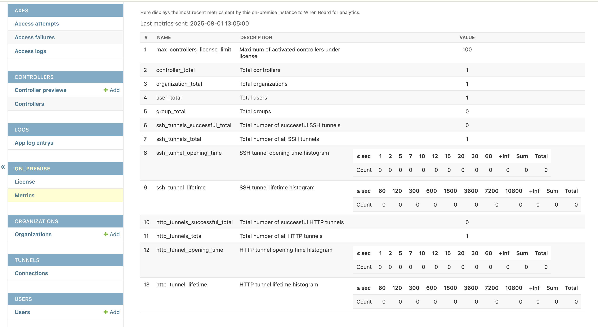

# Wiren Board Cloud On-Premise

> ⚠️ By using this repository or downloading Docker images, you accept the terms of the license agreement (see the LICENSE file).

---

## 📖 Description

Documentation for setting up and deploying Wiren Board Cloud in an On-Premise environment.

### Minimum System Requirements:
- OS: Linux (Ubuntu 24)
- CPU: 2 Cores
- RAM: 6GB
- HDD: 20GB

### Recommended System Requirements:
- OS: Linux (Ubuntu 24)
- CPU: 4 Cores
- RAM: 8GB
- HDD: 40GB

> The minimum configuration is enough for a few dozen controllers: the stack itself takes about 4 GB
> and the rest goes to the database cache. Closer to a hundred controllers the metrics get noticeably
> hungrier — plan for the recommended configuration, and for disk space that matches how long metrics
> are kept (`METRICS_RETENTION_DAYS`, 30 days by default).
>
> Background task parallelism defaults to a hundred controllers and is tunable — see
> [Background task performance](#background-task-performance).


> ⚠️ Your CPU or VM hypervisor must support the `x86-64-v2` instruction set. When using a VM, the `host-passthrough` option (or `CPU=host`) may be required.

### On-Premise Version Features

The main differences between the local cloud and our [wirenboard.cloud](https://wirenboard.cloud) service are related to instance security and reduced server load.

#### User Registration and Demo Access

In On-Premise:
- new users cannot register without an invitation from the organization owner or admin;
- there is no “Demo” button.

#### Metrics

Currently, only the free version for up to 100 controllers is available, and it can be used for personal and commercial purposes. In this version, sending anonymized metrics to our server is required; you can see exactly what is sent in the instance backend under “On-Premise” → “Metrics”.

If your instance cannot connect to our metrics collection server [metrics.wirenboard.cloud](https://on-premise-metrics.wirenboard.cloud), the cloud will continue to work, but you will not be able to add controllers.

Paid plans that allow you to disable metric sending and add more controllers are planned.

Sent metrics, as shown in the backend of the On-Premise instance:


---

## ⚙️ Preconfiguration

Before deploying the application, the following steps must be completed:

### 1. DNS Records

In all examples below, `your-domain.com` means the **full public hostname of your cloud**. If the cloud will be available at `https://cloud.example.com`, use `cloud.example.com` everywhere, not the root domain `example.com`.

The following DNS A records must be configured:

```text
your-domain.com
*.your-domain.com
*.ssh.your-domain.com
*.http.your-domain.com
*.apps.your-domain.com
```

These cover the required subdomains:

```text
metrics.your-domain.com
metrics-ingest.your-domain.com
tunnel.your-domain.com
app.your-domain.com
agent.your-domain.com
ssh.your-domain.com
http.your-domain.com
*.ssh.your-domain.com
*.http.your-domain.com
apps.your-domain.com
*.apps.your-domain.com
```

### 2. Ports

The following ports must be open for the cloud to operate:

- `443` – cloud access
- `7107` – tunnels
- `7501` – tunnel dashboard access (optional)

> ⚠️ If any of these ports are already in use, you can override them in the `.env` file.

> If port `443` is already occupied by another web server, see: [Using with External Web Server](#-using-with-external-web-server-nginxapachecaddytraefik)
>

> 🔒 Detailed network diagram, connection directions, and firewall rules — [doc/SECURITY_NETWORK.md](./doc/SECURITY_NETWORK.md)

### 3. DNS Records for Email

MX, SPF, DKIM, and DMARC records must be configured to enable email sending.
This is required for sending organization invitations, password resets, etc.

> If email is disabled (see [Working Without Email](#working-without-email)), you can skip this step.


### 4. TLS Certificates

Certificates must be issued by a trusted CA:
- Let's Encrypt (DNS challenge)
- Commercial CAs (Sectigo, DigiCert, etc.)

> ❌ Self-signed certificates are not supported.

If you already have a certificate for this hostname, check the SANs (Subject Alternative Names):

The certificate must be issued for the same value as `ABSOLUTE_SERVER`, including the subdomain. For example, if the cloud runs on `cloud.example.com`, the certificate must cover `cloud.example.com`, `*.cloud.example.com`, `*.http.cloud.example.com`, `*.ssh.cloud.example.com`, and `*.apps.cloud.example.com`.

```bash
openssl x509 -in "path/to/your/certs/fullchain.pem" -noout -text | grep -A1 "Subject Alternative Name"
```

The certificate must include:

```text
your-domain.com
*.your-domain.com
*.http.your-domain.com
*.ssh.your-domain.com
apps.your-domain.com
*.apps.your-domain.com
```

Otherwise, you must obtain a new certificate.

> ⚠️ `make check-certs` validates this list and refuses to start the cloud if a domain is missing. In particular, a certificate without `*.apps.your-domain.com` fails the check.

Place `fullchain.pem` and `privkey.pem` in the `./tls` directory or set the `TLS_CERTS_PATH` environment variable.

#### Certificate renewal

Let's Encrypt certificates are valid for 90 days. Traefik reads the certificate files at startup and
**does not re-read them on its own**, so the container has to be restarted after every renewal —
otherwise the cloud keeps serving the expired certificate even though the new one is already on disk.

Only Traefik has to re-read the certificate, the rest of the stack can keep serving — that is what
`make reload-certs` does. If the certificate is issued through certbot, put it into its hook and
renewal stays fully automatic:

```bash
sudo certbot renew --deploy-hook "cd /path/to/cloud-on-premise && make reload-certs"
```

Renewing by hand once:

```bash
sudo certbot renew
make reload-certs
```

> The command checks the new certificate first (`make check-certs`) and only then restarts Traefik —
> if the renewal went wrong, the cloud keeps running on the old certificate.


To get a certificate using Certbot, see: [Manual Wildcard Certificate Setup Example](#-manual-wildcard-certificate-setup-example)

---

### Deploying in a Private LAN (no public access)

The cloud can run entirely inside a local network, without a public IP address. However, the certificate must still be a valid public one (see step 4): the controller agent `wb-cloud-agent` strictly verifies TLS, so with a self-signed certificate no activation link will be issued — even if the web interface opens in a browser.

> ⚠️ The `make run-no-cert-check` target only skips the local check of certificate files before startup. It does **not** disable TLS verification on controllers and does not make a self-signed certificate work.

Working setup:

1. Take a subdomain of a real domain you own, e.g. `cloud.example.com`.
2. Obtain a wildcard certificate via DNS challenge — no public access to the server is required for this, see [Manual Wildcard Certificate Setup Example](#-manual-wildcard-certificate-setup-example).
3. In your internal DNS, create A records pointing the cloud's full hostname and all subdomains (see [1. DNS Records](#1-dns-records)) to the server's local IP.
4. Set `ABSOLUTE_SERVER=cloud.example.com`.

> 💡 The `*.ssh.your-domain.com`, `*.http.your-domain.com`, and `*.apps.your-domain.com` entries require wildcard DNS records. Consumer router DNS does not support them — use dnsmasq, Pi-hole, AdGuard Home, or a full DNS server instead.

Controllers must resolve the same hostname via the same internal DNS as the rest of the network.

---

### 5. Custom Logo and Icons

This step is optional.

The frontend and the web console read branding assets from the local `branding/` directory, which is mounted into the `frontend` and `webssh` containers.
If you do not add your own files there, the application will continue using the default Wiren Board logo and icons.

To replace the logo and icons, place your files in that directory with the exact names listed below. File requirements:

| File | Format and size | Used for |
|---|---|---|
| `branding/logo.svg` | SVG, landscape, 160×40 as a reference (rendered 160px wide, height scales proportionally) | logo in the web UI and web console header |
| `branding/favicon.svg` | SVG, square | tab icon in modern browsers |
| `branding/favicon.ico` | ICO, 16–64 px sizes | tab icon in older browsers |
| `branding/favicon-192.png` | PNG, exactly 192×192 | app icon (web manifest) |
| `branding/favicon-512.png` | PNG, exactly 512×512 | app icon (web manifest) |
| `branding/apple-touch-icon.png` | PNG, 180×180 | iOS home screen icon |

Sizes are not validated automatically: a file with wrong proportions is served as is and may render incorrectly.

You can also replace only some of these files.

If the project is already running, restart the frontend and the web console after replacing the files:

```shell
docker compose restart frontend webssh
```

Besides the assets, you can override the product name, links, and color shown in the web UI and the web console. Uncomment and fill in these variables in `.env`:

```text
SERVICE_NAME       — product name: UI texts and the browser tab title (default: "Wiren Board Cloud")
SERVICE_STATUS_URL — your service status page link (not set or empty — the status link is hidden)
SERVICE_DOCS_URL   — documentation link (not set — Wiren Board wiki; empty — the docs link is hidden)
PRIMARY_COLOR      — primary button color as hex (e.g. #e2500a); when not set, the default color is used
FOOTER_SITE_URL    — company site link in the footer (not set — wirenboard.com; empty — the link is hidden)
FOOTER_SITE_LABEL_RU — caption of that link for Russian (default: "Сайт компании Wiren Board")
FOOTER_SITE_LABEL_EN — caption of that link for English (default: "Wiren Board website"); when only one label is set, it is used for both languages
```

If the variables are not set, the Wiren Board defaults are used. Restart the frontend and the web console after changing `.env`.

---

## 🚀 Application Deployment

> You need `docker compose v1.21.0` or higher to run the application.

### 1. Configure Environment Variables

Copy the sample environment file:

```bash
cp .env.example .env
nano .env
```

Fill in the required variables as in the example below.
The `EMAIL_*` variables can be left unset if email sending is disabled — see [Working Without Email](#working-without-email).

`ABSOLUTE_SERVER` must match the full public hostname of the cloud. If the cloud will be available at `https://cloud.example.com`, set `ABSOLUTE_SERVER=cloud.example.com`.

```dotenv
ABSOLUTE_SERVER=my-domain-name.com

# Cloud administrator. The email is also the login
ADMIN_EMAIL=admin@mail.com
ADMIN_PASSWORD=password

# Email sending (True/False). When False, no emails are sent; invitations and
# password resets are handled via the admin panel — see "Working Without Email".
EMAIL_ENABLED=True
EMAIL_HOST=smtp.mail.com
EMAIL_PORT=587
EMAIL_HOST_USER=mymail@mail.com
EMAIL_HOST_PASSWORD=password
EMAIL_NOTIFICATIONS_FROM=mymail@mail.com
# TLS on port 587. For the SSL port 465 set EMAIL_USE_SSL=True instead
EMAIL_USE_TLS=True

# Application database
POSTGRES_DB=db_name
POSTGRES_USER=postgres_user
POSTGRES_PASSWORD=postgres_password

# Metrics dashboards (Grafana). This account signs in at metrics.<your domain>
GRAFANA_ADMIN_USER=grafana_admin
GRAFANA_ADMIN_PASSWORD=grafana_password

# Tunnel service ports and its dashboard account
TUNNEL_PORT=7107
TUNNEL_DASHBOARD_PORT=7501
TUNNEL_DASHBOARD_USER=tunnel_admin
TUNNEL_DASHBOARD_PASSWORD=tunnel_password

#--------------------------------------------------------------------------
# Optional ----------------------------------------------------------------
#--------------------------------------------------------------------------

# How long controller metrics are kept. Raise it if you have the disk space
#METRICS_RETENTION_DAYS=30

# Session geolocation. When True, the DB-IP City Lite database (~62 MB) is
# downloaded on `make run` — see "Session Geolocation"
#GEOIP_ENABLED=True

# Override the organization invitation email subject and body.
# Leave commented to keep the built-in RU/EN translation (selected by the
# inviter's language).
# Use \n in INVITE_EMAIL_BODY for line breaks; the invitation link is always
# appended at the end of the body.
#INVITE_EMAIL_SUBJECT="You have been invited to a Wiren Board Cloud organization"
#INVITE_EMAIL_BODY="Hello!\nYou have been invited to our organization.\nClick the link to register:"

# Set the path to the directory with TLS certificates if required. Default is "./tls"
#TLS_CERTS_PATH=path/to/my/certs/

# Set Docker network name if required. Default is "wb_net"
#DOCKER_NET_NAME=my-docker-network

# Set the external port for Traefik
#TRAEFIK_EXTERNAL_PORT="127.0.0.1:8443"

```

> ⚠️ For the submission port 587 keep `EMAIL_USE_TLS=True`; for the SSL port 465 drop it and set `EMAIL_USE_SSL=True` instead.
> After editing `.env`, restart the stack: `make restart`.

> 💡 Email sending can be disabled entirely — see [Working Without Email](#working-without-email).

### 2. Automatic Initialization and Launch

Install `make` if it is not already installed:

```bash
apt install make
```

Then run:

```bash
make run
```

✅ Your cloud is now ready.

---

## ▶️ Usage

### User Registration

User self-registration is disabled in the On-Premise cloud.
Only one admin user will be available initially, using credentials from `ADMIN_EMAIL` and `ADMIN_PASSWORD`.
Since release 2.0.0 the email is the login, so the administrator signs in with the `ADMIN_EMAIL` value.

> ⚠️ You may change the password or create another admin user. However, the user specified in `.env` will be recreated on each restart if deleted.

The admin must create the first organization manually via the [admin panel](#admin-panel). New users can be added via the [admin panel](#admin-panel) or email invitation.

### Admin Panel

The admin panel (Django admin) is available at `https://app.your-domain.com/admin/`.
Log in with the admin credentials from the `ADMIN_EMAIL` and `ADMIN_PASSWORD` environment variables.

It is used by the administrator to create the first organization, invite and manage users, and manage system objects.

> ⚠️ The admin panel grants full access to the instance data — do not expose it publicly unless necessary.

### Controller Setup

To configure your controller to work with your on-premises cloud, follow these steps:

#### 1. Add a Cloud Provider

In all commands below, use the same external hostname as in `ABSOLUTE_SERVER`. If the cloud is deployed on a subdomain, use that full subdomain here.

##### In new releases starting with wb-2507 and testing (agent > 1.5.14)

```bash
wb-cloud-agent use-on-premise https://your-domain.com
```

> After `your-domain.com` becomes available on the network, the `wb-cloud-agent` command displays an activation link that allows you to link the controller to your cloud.

##### In older releases up to and including wb-2504 (agent <= 1.5.14)

Open the controller's console and execute the following command:
```bash
wb-cloud-agent add-provider your-onpremise-name https://your-domain.com/ https://your-domain.com/api-agent/v1/
```
Where:
- `your-onpremise-name` - provider name (can be any value)
- `https://your-domain.com/` - cloud address
- `https://your-domain.com/api-agent/v1/` - cloud agent address (always: `cloud address` + `/api-agent/v1/`)

> After `your-domain.com` becomes available on the network, go to the controller web UI, open Settings -> System, and use the activation link to link the controller to your cloud.

#### 2. Link the Controller to a User

Go to the controller’s web interface and select:

`Settings` -> `System` -> `Cloud Connection (your-onpremise-name)`

> If you do not see the System section in `Settings`, you do not have administrator rights.
>
> Go to `Settings` -> `Access Rights`, select `Administrator` -> `I accept all responsibility...` -> `Apply`.
>
> After this, the `System` section will appear in the menu.

Follow the link, log in to the cloud, and select the organization you want to add the controller to.

Your controller is now successfully linked to the cloud.

> ⚠️ Sending controller metrics to the On-Premise cloud is supported only on `wb-cloud-agent` versions up to and including `1.6.14`. On newer agent versions, controller metrics will not be sent to the On-Premise cloud.

### Controller Web Services

The cloud publishes the web interfaces of services running on a controller
(e.g. Node-RED) through the cloud tunnel. Each service gets an address of the
form `<serial>-<port>.apps.your-domain.com`, reachable only after cloud
authorization. Up to 20 services can be published per controller.

What the cloud operator must provide:

- a wildcard DNS record `*.apps.your-domain.com` (see [1. DNS Records](#1-dns-records));
- a certificate with the `apps.your-domain.com` and `*.apps.your-domain.com`
  SANs (see [4. TLS Certificates](#4-tls-certificates)). Wildcards are issued
  only via the DNS-01 challenge (HTTP-01 cannot issue wildcards) — the same
  mechanism used for the rest of the cloud certificate.

`*.apps.your-domain.com` is part of the mandatory certificate domain set:
without it `make check-certs` — and therefore `make run` — fails.

### Session Geolocation (GeoIP)

The cloud can show the country and city by IP address in the user's active
sessions list. To enable it, uncomment in `.env`:

```dotenv
GEOIP_ENABLED=True
```

On `make run` (specifically during `make generate-env`) the DB-IP "IP to City
Lite" database (~62 MB, CC BY 4.0 license) is downloaded into `./geoip`
automatically.

DB-IP publishes a new database every month, while the automatic download only fetches a missing
one. Refresh it with `make update-geoip` — the old database is replaced only after a complete
download, so a failed refresh breaks nothing.

If the server has no internet access, the script prints the fallback: download
the "IP to City Lite" database in MMDB format from
[db-ip.com/db/download/ip-to-city-lite](https://db-ip.com/db/download/ip-to-city-lite)
on any machine with internet access, put the unpacked file at
`./geoip/dbip-city-lite.mmdb`, and run `make restart`.

Geolocation itself works fully offline: the cloud makes no outbound requests.
DB-IP updates the database monthly — update at will (just replace the file).

Without the database everything works, the location in the sessions list simply
stays empty. Private addresses (LAN/VPN) are not geolocated — this is by design.

---

## 🎛 Environment Variables

You can override some environment variables manually in `.env`. If a variable is already set, it won’t be generated again.

Example:

```dotenv
# Token for opening tunnels
TUNNEL_AUTH_TOKEN=GLgTbKtCiwF8J4tI439NJba0pbXfW0a39E7jZOOr0qO67xonhhfaNIWiH7FzPP

# Secret key for Django
SECRET_KEY=40h0EtROD1krOPzZ/PSiCgnZgbOc+x0omKJrpzH9JDDbwXBTf4

```

For JWT, place `private.pem` and `public.pem` in the `jwt` directory; otherwise, they will be generated automatically.

### Background task performance

The cloud spreads background work across four queues, each with its own worker and its own
concurrency setting.

| Variable | Default | What the queue does | When to raise it |
|---|---|---|---|
| `WORKER_CONCURRENCY` | 4 | General work: controller activation, tunnel bookkeeping, licensing | Many controllers connecting and disconnecting at once |
| `METRICS_WORKER_CONCURRENCY` | 3 | Metrics: collector config rollout, TimescaleDB roles and retention | The controller count grows, metrics appear late |
| `GRAFANA_WORKER_CONCURRENCY` | 3 | Grafana dashboards and users | Many organizations and users, dashboards are slow to appear |
| `EMAIL_WORKER_CONCURRENCY` | 2 | Sending mail: invitations, password resets, alerts | Bulk invitations or many alert rules |

**The defaults are sized for a hundred controllers** — the cap of the free version. A normal
installation does not need them raised: memory and disk for the metrics run out first.

Every unit of concurrency is a separate process, roughly **85 MB**. The arithmetic is simple: `+1`
on any variable is another ~85 MB.

| Profile | Values | Worker memory |
|---|---|---|
| Minimal: a few controllers, saving memory | 2 / 1 / 1 / 1 | ~0.5 GB |
| **Default: up to 100 controllers** | **4 / 3 / 3 / 2** | **~1.3 GB** |
| Large installation: many organizations, bulk mailings | 8 / 8 / 8 / 4 | ~2.5 GB |

There is no upper limit beyond the server's memory.

**How to tell you need more.** The symptom is not a slow interface but a late result: a dashboard
that took a while to appear, metrics from a new controller that did not show up within a minute, an
email that went out late. The objective measure is the queue length — if it stays above zero, work
is piling up:

```bash
docker compose exec redis redis-cli llen metrics_queue
```

The queues are `default_queue`, `metrics_queue`, `grafana_queue`, `email_queue`. Apply changes to
`.env` with `make restart`.

> The table is derived from the per-process memory cost and from our own cloud's settings; actual
> throughput depends on your workload, so trust your own queue lengths first.

### Working Without Email

If you do not have an SMTP server, the cloud can run without sending email. Set the following in `.env`:

```dotenv
EMAIL_ENABLED=False
```

With `EMAIL_ENABLED=False`:

- emails are silently not sent — no errors are raised;
- the `EMAIL_*` variables can be left unset: `make run` and `make check-env` do not require them;
- DNS records for email (section [3. DNS Records for Email](#3-dns-records-for-email)) are not needed;
- **inviting a user to an organization** (two steps, since no email is sent):
  1. in the frontend, the organization owner or admin invites the user by email (in the organization members section);
  2. open the [admin panel](#admin-panel) → **Organizations** → the relevant organization → the **Organization invites** block, and copy the value of the **link** field. Pass the link to the user by any means — they will register via it without email confirmation.

  > You cannot create an invitation directly from the admin panel — it only shows the link of already existing invitations. The invitation itself is created in the frontend (step 1).
- **resetting a user's password:** in the [admin panel](#admin-panel) open the **Users** section, select the user with a checkbox, choose the **“Generate password reset link”** action from the **Action** dropdown list, and click “Go”. The link appears in a green message at the top of the page — copy it and pass it to the user. Users without a usable password (e.g. signed in via social login) are skipped.

> ⚠️ Since release 2.0.0 the `EMAIL_ENABLED` variable is mandatory: the stack does not start without an explicit `True`/`False`.

---

## 📦 Makefile Commands

Run all commands from the repo root.

### Main Commands

| Command                  | Description                                                  |
|--------------------------|--------------------------------------------------------------|
| `make help`              | Show all available commands                                  |
| `make check-env`         | Check required environment variables in `.env`               |
| `make check-certs`       | Check certificate availability and validity                  |
| `make generate-env`      | Generate missing tokens/secrets                              |
| `make generate-jwt`      | Generate or update JWT keys                                  |
| `generate-tunnel-token`  | Generate token for SSH/HTTP tunnels                          |
| `generate-django-secret` | Generate Django SECRET_KEY                                   |
| `make run`               | Full launch cycle (generate-env, cert check, build and start containers) |
| `make run-no-cert-check` | Same without the TLS certificate check (not recommended)     |
| `make stop`              | Stop containers                                              |
| `make restart`           | Restart containers (with the cert check)                     |
| `make update`            | Stop containers, update images, rebuild and restart          |
| `make upgrade`           | 1.x → 2.0 upgrade: backup, fix users, migrate, start         |
| `make fix-users MODE=…`  | Run migration_doctor (`scan` / `auto` / `resolve` / `dump` / `apply`) |
| `make backup`            | Back up PostgreSQL (+ InfluxDB if running) into `./backups`  |

### Usage Examples

```sh
# First launch (environment initialization and container startup)
make run

# Update the project to the latest state
make update

# Validate environment variables
make check-env

# Command help
make help
```

---

## ⬆️ Upgrading from 1.x to 2.0

The **2.0** release is incompatible with 1.x, but **user data is not discarded**
— it is migrated in place. The key change: **email becomes the login** — it is
mandatory, unique, and must equal the `username`. The upstream migration that
enforces this (`users/0013`) does not backfill data, so the database must be
repaired before migrating.

### Migration conditions — read before running

Upgrade **only if** you are currently on a 1.x version (see the `VERSION` file, or the
web interface footer, which shows the version). Before `make upgrade`, make sure:

- **The certificate has been reissued with `*.apps.<domain>`.** Since release 2.0.0 controller web
  services are a standard feature, so `*.apps.your-domain.com` belongs to the mandatory
  domain set. If your 1.x certificate does not cover it, `make upgrade` stops at
  `make check-certs` before the backup: reissue the certificate (see
  [4. TLS Certificates](#4-tls-certificates)) and add the `*.apps` DNS record.
- **There is room for the backup.** The backup (`pg_dump` + `influxd backup`) is written
  to `./backups` — ensure there is disk space for a copy of the database. The command
  takes the backup itself, **before** any change; a manual backup is not required but does
  no harm.
- **The 1.x stack is running.** `migration_doctor` works inside the still-running 1.x
  backend container. Do not stop the containers before upgrading — `make upgrade` manages
  them for you.
- **Every user must have a valid, unique email equal to the login.** That is the point of
  the migration. Conflicts you may have to resolve by hand:
  - **admin with no email** (typical 1.x case: `username="admin"`, `email=""`) — set
    `ADMIN_EMAIL` in `.env` and it is fixed automatically;
  - **users with no email** — a real email must be supplied for each;
  - **duplicate emails** (case-insensitive) — only one owner can keep it; the rest need a
    different address.
- **InfluxDB metrics are not converted.** Metric history is preserved as a backup
  alongside; new metrics accumulate in TimescaleDB from scratch. Keep
  `./backups/influx-<ts>/` if the historical metrics DB matters to you.
- **If there are no conflicts** (everyone already has a valid, unique email = login) the
  migration runs **with zero manual steps**: `make upgrade` backs up, scans, migrates, and
  brings up the 2.0 stack on its own.

A single command does the whole thing:

```sh
make upgrade
```

What `make upgrade` does:

1. **`.env` preparation**: if `EMAIL_ENABLED` is unset, `True` is appended (the 1.x
   behaviour); the old email variables (`EMAIL_SERVER`, `EMAIL_LOGIN`,
   `EMAIL_PASSWORD`, `EMAIL_PROTOCOL`) are converted to the 2.0 names
   (`EMAIL_HOST`, `EMAIL_HOST_USER`, `EMAIL_HOST_PASSWORD`, `EMAIL_USE_TLS`/`EMAIL_USE_SSL`).
   Then `make generate-env` and `make check-certs` run.
2. **Mandatory backup** (before ANY DB change): `pg_dump` of the main PostgreSQL
   and `influxd backup` of the InfluxDB metrics (if that service is still
   running) into `./backups`. InfluxDB is **not** converted to TimescaleDB — it
   is kept alongside so you can consult the historical metrics later. New metrics
   accumulate in TimescaleDB.
3. **User-table scan** (`migration_doctor`, read-only): finds rows that violate
   the 2.0 invariants — blank email, `username != email`, duplicate email
   (case-insensitive) — and prints a table with counts. If any conflict remains,
   the upgrade **stops** (non-zero exit), migration does NOT run, and the fix
   command is printed.
4. **`migrate` on the 2.0 image** (`docker compose pull` + `manage.py migrate`).
5. **Bringing up the 2.0 stack** (`docker compose up -d --build`).

### Resolving user conflicts

`migration_doctor` runs inside the still-running backend container (via the
Django ORM, touching only `username`/`email`) and is idempotent — run it until 0
conflicts remain.

```sh
# Read-only conflict report:
make fix-users MODE=scan

# Apply the safe auto-fixes (lowercase email; collapse case/whitespace-only
# differences; admin email from ADMIN_EMAIL):
make fix-users MODE=auto

# Interactive wizard: prompts for the correct email per conflict, validating the
# address and checking for collisions:
make fix-users MODE=resolve

# Headless (no TTY): dump conflicts to a file, edit it, apply:
make fix-users MODE=dump          # writes migration/conflicts.yaml
#   ...edit the new_email field on each row...
make fix-users MODE=apply         # reads the file back
```

When `make fix-users MODE=scan` reports `Conflicts: 0`, re-run `make upgrade`:
migration applies and the 2.0 image comes up.

> The backup `./backups/pg-<ts>.sql.gz` is your safety net. If migration is
> interrupted for any reason, restore the database from that dump and retry.

---

## 🛠 Manual Wildcard Certificate Setup Example

### Install Certbot

```bash
sudo apt update && sudo apt install certbot -y
```

### Obtain Wildcard Certificate

Set the email and the full public hostname of the cloud. If the cloud will be available at `https://cloud.example.com`, then `DOMAIN_NAME=cloud.example.com`.

```bash
export EMAIL=admin@email.com
export DOMAIN_NAME=your-domain-name.com
```

```bash
sudo certbot certonly --manual --preferred-challenges dns \
  --agree-tos \
  --email $EMAIL \
  --key-type rsa \
  -d $DOMAIN_NAME \
  -d "*.$DOMAIN_NAME" \
  -d "*.ssh.$DOMAIN_NAME" \
  -d "*.http.$DOMAIN_NAME" \
  -d "apps.$DOMAIN_NAME" \
  -d "*.apps.$DOMAIN_NAME"
```

> All six `-d` lines are mandatory: without `*.apps.$DOMAIN_NAME` the certificate fails `make check-certs`.

Add DNS TXT records as prompted by Certbot. Use `dig` to verify.

Certificates are saved to:

```
/etc/letsencrypt/live/your-domain.com/fullchain.pem
/etc/letsencrypt/live/your-domain.com/privkey.pem
```

### Verify RSA Key

```bash
openssl rsa -in /etc/letsencrypt/live/$DOMAIN_NAME/privkey.pem -check -noout
```

---

## 🛡 Using with External Web Server (Nginx/Apache/Caddy/Traefik)

If port 443 is already used by another web server, configure as follows:

> ⚠️ In all examples below `your-domain.com` is the **full cloud hostname** — the
> same value as `ABSOLUTE_SERVER`. If the cloud is deployed on a subdomain
> (e.g. `cloud.example.com`), substitute the whole subdomain: in regexes this
> becomes `cloud\.example\.com` (dots escaped as `\.`), and the wildcard forms
> become `[^.]+\.cloud\.example\.com` etc. An SNI that does not match the regex
> will not be forwarded to the cloud's Traefik — the browser will show a
> certificate error or a dropped connection.

### 1. Set the following in `.env`:
```dotenv
TRAEFIK_EXTERNAL_PORT=127.0.0.1:8443
```

### 2. Proxy via an External Web Server

> ⚠️ **The `agent.*` subdomain uses mutual TLS (mTLS): the controller presents a hardware client certificate that Traefik verifies.**
> Standard L7 proxying (where Nginx terminates TLS) **does not forward the client certificate**, which breaks controller authentication.
> Therefore, all on-premise traffic must use **L4 TCP passthrough** via the `stream` module — Nginx forwards the raw TCP connection and Traefik handles TLS termination and mTLS verification itself.

#### Case A: Nginx is used only for on-premise traffic

Remove the existing `server { listen 443 ssl; ... }` block for on-premise domain names and add a `stream` block at the top level of your config:

```nginx
# /etc/nginx/nginx.conf — top-level, not inside http {}
stream {
    server {
        listen 443;
        ssl_preread on;
        proxy_pass 127.0.0.1:8443;
    }
}
```

All HTTPS requests on port 443 will be transparently forwarded to Traefik on port 8443.

#### Case B: Nginx also serves other sites on port 443

Use `ssl_preread` with a `map` to route by SNI: on-premise domain names go to Traefik, and everything else goes to a separate Nginx HTTP listener.

```nginx
# /etc/nginx/nginx.conf — top-level, not inside http {}
stream {
    map $ssl_preread_server_name $upstream {
        ~^(.+\.)?your-domain\.com$  127.0.0.1:8443;  # on-premise → Traefik
        default              127.0.0.1:444;   # other sites → Nginx HTTP
    }

    server {
        listen 443;
        ssl_preread on;
        proxy_pass $upstream;
    }
}

# In the http {} block, other sites listen on port 444
server {
    listen 444 ssl;
    server_name your-domain.com;

    ssl_certificate     /etc/letsencrypt/live/your-domain.com/fullchain.pem;
    ssl_certificate_key /etc/letsencrypt/live/your-domain.com/privkey.pem;

    location / {
        # your usual settings
    }
}
```

> Ensure port 8443 is bound only to 127.0.0.1 and not exposed publicly.

#### Case C: External Traefik (TCP passthrough)

If another Traefik already sits in front of the cloud (e.g. an edge reverse proxy in a DMZ), route traffic by SNI at L4 and **always with `passthrough`** — for the same reason as Nginx above: the external Traefik must not terminate TLS, otherwise the controllers' mTLS authentication on `agent.*` breaks.

Unlike the Nginx examples, the external proxy must forward **all three entry points** of the cloud, not just 443:

- `443` — web UI, API and agent endpoint;
- `7107` — tunnels;
- `7501` — tunnel dashboard (optional).

**1. Static config of the external Traefik.** Declare all three entry points — otherwise Traefik drops the `tunnel`/`tunnelui` routers with an `entryPoint ... doesn't exist` error in the log:

```toml
[entryPoints.websecure]
  address = ":443"
[entryPoints.tunnel]
  address = ":7107"
[entryPoints.tunnelui]
  address = ":7501"
```

Make sure these ports are published (exposed) on the external Traefik itself.

**2. Dynamic config** (file provider) — route by SNI to the cloud host:

```yaml
tcp:
  routers:
    wbc-https:
      entryPoints: ["websecure"]
      rule: "HostSNIRegexp(`^(your-domain\\.com|[^.]+\\.your-domain\\.com|[^.]+\\.(http|ssh|apps)\\.your-domain\\.com)$`)"
      tls:
        passthrough: true          # ⚠️ do not terminate TLS — required for controller mTLS
      service: wbc-https

    # Controller tunnels
    wbc-tunnel:
      entryPoints: ["tunnel"]
      rule: "HostSNI(`*`)"
      service: wbc-tunnel

    # Tunnel UI
    wbc-tunnel-ui:
      entryPoints: ["tunnelui"]
      rule: "HostSNI(`*`)"
      service: wbc-tunnel-ui

  services:
    wbc-https:
      loadBalancer:
        servers:
          - address: "<cloud-host>:443"
    wbc-tunnel:
      loadBalancer:
        servers:
          - address: "<cloud-host>:7107"
    wbc-tunnel-ui:
      loadBalancer:
        servers:
          - address: "<cloud-host>:7501"
```

where `<cloud-host>` is the address of the on-premise cloud server, and `your-domain.com` is the cloud's full hostname (same as `ABSOLUTE_SERVER`).

> ⚠️ The `HostSNIRegexp` rule requires Traefik **v3**: Traefik v2 TCP routers have no `HostSNIRegexp`, so this config will not work there.

> ⚠️ Mind the YAML quoting: inside **double** quotes backslashes are doubled
> (`your-domain\\.com`, as in the example above); inside **single** quotes they
> stay single (`your-domain\.com`). A single `\.` inside double quotes produces
> `yaml: found unknown escape character`, the file provider drops the whole file,
> and Traefik starts serving its default certificate instead of passing TLS through.

> The rule matches the same hosts your cloud's wildcard certificate covers (see the "TLS Certificates" section): `your-domain.com` itself, any first-level subdomain (`app.`, `agent.`, `ssh.`, `http.`, etc.), per-controller `<id>.http.`/`<id>.ssh.`, and `<serial>-<port>.apps.`. Substitute your own `ABSOLUTE_SERVER` domain for `your-domain.com`.

> If you only need to expose controller traffic through the external proxy, keeping the cloud web interface unreachable from outside, narrow the regexp down to `agent.your-domain.com` and the per-controller `<id>.http.`/`<id>.ssh.` hosts.

> If the external Traefik runs on the same server as the cloud, additionally move the cloud's internal Traefik to a local port via `TRAEFIK_EXTERNAL_PORT` (see the top of this section) and proxy to `127.0.0.1` so the ports do not conflict.

---
