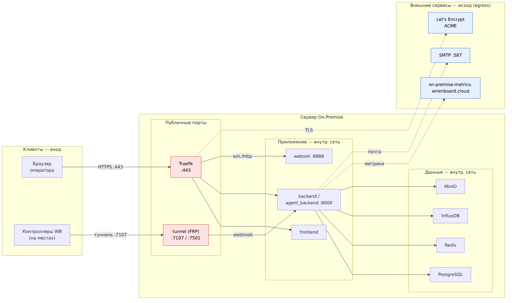
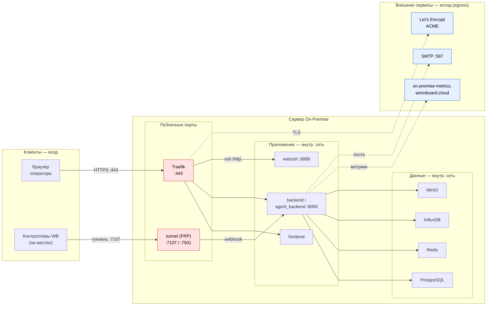

# Сетевая схема и порты (On-Premise) — для службы безопасности

> **Назначение.** Данные для настройки межсетевого экрана (firewall): какие порты
> открывать, кто и в каком направлении инициирует соединения, какие исходящие
> каналы есть у инсталляции. Сверено с `docker-compose.yml`, `.env.example`,
> `traefik/` и `README(_EN).md` на момент написания (release/1.2.0).

## 1. Обзор

On-Premise — это облако Wiren Board, развёрнутое на стороне заказчика. Точка входа
веб-трафика — обратный прокси **Traefik**. Отдельно публикуется **порт туннелей**,
через который **контроллеры подключаются к облаку** (исходящее соединение со стороны
контроллера → входящее на облако). Базы, кэш, хранилище и InfluxDB наружу не
публикуются.

Принципиально: наружу инсталляция публикует **ровно два набора портов** —
веб (443) и туннели (7107, опц. 7501). Всё остальное — внутри docker-сети.

## 2. Таблица портов

| Сервис | Порт (host) | Публичный? | Назначение |
|--------|-------------|-----------|------------|
| **traefik** | `443` (override: `TRAEFIK_EXTERNAL_PORT`) | **да** | Веб-доступ к облаку (HTTPS/TLS), API, фронтенд, agent, ssh/http-прокси к туннелям |
| **tunnel** | `7107` | **да** | Туннели контроллеров (FRP). Контроллеры устанавливают соединение СЮДА |
| **tunnel** | `7501` | да (опц.) | Tunnel dashboard (за Basic Auth, можно не открывать наружу) |
| postgres | — | нет | БД, только внутри docker-сети |
| redis | — | нет | Кэш/брокер, только внутри сети |
| influx (InfluxDB) | — | нет | Хранилище метрик контроллеров, только внутри сети |
| minio | — | нет | Объектное хранилище, только внутри сети |
| backend / agent_backend | — | нет | API (`:8000`), доступны только Traefik'у/tunnel_auth |
| webssh | — | нет | SSH-в-браузере (`:8888`), проксируется через tunnel_auth |
| frontend | — | нет | SPA, доступен только Traefik'у |
| worker / worker-influx / worker-grafana / scheduler | — | нет | Фоновые задачи |

> `TRAEFIK_EXTERNAL_PORT` позволяет увести Traefik на локальный порт (например
> `127.0.0.1:8443`) — это режим «за внешним веб-сервером» (см. §7).

## 3. DNS / сабдомены

Сертификат и DNS должны покрывать (где `your-domain.com` — полный хост облака):

```
your-domain.com            app.your-domain.com      agent.your-domain.com
metrics.your-domain.com    influx.your-domain.com   tunnel.your-domain.com
ssh.your-domain.com        http.your-domain.com
*.ssh.your-domain.com      *.http.your-domain.com
```

Wildcard `*.ssh` / `*.http` — это per-controller доступ к туннелированным контроллерам
(каждый контроллер получает свой сабдомен ssh/http через облако).

## 4. Диаграмма направлений



> Картинка выше сгенерирована из mermaid-исходника ниже
> (`assets/onprem-network.mmd`). Правим `.mmd` → перегенерим PNG:
> `docker run --rm -u "$(id -u):$(id -g)" -v "$PWD/assets":/data minlag/mermaid-cli -i /data/onprem-network.mmd -o /data/onprem-network.png -b white --scale 2`



## 5. Кто инициирует соединения

| Канал | Инициатор | Назначение | Порт | Направление |
|-------|-----------|------------|------|-------------|
| Веб-доступ | Браузер оператора | Traefik | 443 | **вход** |
| Туннели контроллеров | **Контроллер WB** | tunnel (FRP) | 7107 | **вход** (контроллер дозванивается в облако) |
| Tunnel dashboard | Браузер админа | tunnel | 7501 | вход (опц.) |
| БД / кэш / хранилище / метрики | backend, worker | postgres / redis / minio / influx | — | внутри сети |
| **Метрики к WB** | backend | `on-premise-metrics.wirenboard.cloud` | 443 | **исход (egress)** |
| Почта | backend | SMTP (`EMAIL_HOST`) | 587 | исход |
| TLS-сертификаты | Traefik | Let's Encrypt ACME | 443 | исход |

## 6. Туннели и метрики — важное для безопасников

**Туннели (FRP, порт 7107).** Контроллеры на объектах сами устанавливают исходящее
соединение к облаку на порт 7107 (авторизация по `TUNNEL_AUTH_TOKEN`). Облако затем
даёт доступ к каждому контроллеру через сабдомены `*.ssh.` (SSH-в-браузере, сервис
`webssh`) и `*.http.` (веб-интерфейс контроллера). То есть **7107 нужно открыть на
вход** со стороны сетей, где стоят контроллеры. 7501 (dashboard) — опционально, за
Basic Auth.

**Метрики к серверу WB (egress).** Инсталляция **обязательно** отправляет
анонимные метрики на наш сервер `https://on-premise-metrics.wirenboard.cloud`
(бесплатная версия до 100 контроллеров). Если этот egress закрыт фаерволом —
облако продолжит работать, но **нельзя будет добавлять новые контроллеры**. Состав
отправляемых метрик виден в бэкенде инсталляции: «On-Premise» → «Metrics». Внутри
метрики контроллеров хранятся в локальном **InfluxDB** (наружу не публикуется).

> ⚠️ Отправка метрик С контроллеров поддерживается только на `wb-cloud-agent` ≤ 1.6.14;
> на новых агентах метрики контроллеров в On-Premise облако не отправляются.

## 7. Правила межсетевого экрана

### INBOUND — открыть

| Порт | Протокол | Источник | Зачем |
|------|----------|----------|-------|
| **443** | TCP/HTTPS | операторы (или CIDR заказчика) | Веб-доступ к облаку |
| **7107** | TCP | сети с контроллерами WB | Туннели контроллеров (FRP) |
| 7501 | TCP | админ (опц.) | Tunnel dashboard |
| 80 | TCP | — | Только если TLS через ACME http-challenge; иначе закрыть |

**НЕ открывать наружу:** порты postgres / redis / influx / minio / backend:8000 /
webssh:8888 — они только внутри docker-сети.

### OUTBOUND — egress

| Назначение | Хост | Порт | Можно закрыть? |
|------------|------|------|----------------|
| Метрики WB | `on-premise-metrics.wirenboard.cloud` | 443 | Закрытие = нельзя добавлять контроллеры (на free-плане обязательно) |
| Почта | `EMAIL_HOST` (SMTP) | 587 | Да, если email-уведомления не нужны |
| Let's Encrypt ACME | `acme-v02.api.letsencrypt.org` | 443 | Да, при ручных сертификатах / DNS-challenge |

## 8. Внешний обратный прокси перед Traefik

Если перед Traefik ставится внешний веб-сервер (nginx/apache/caddy) — требование
безопасности заказчика — Traefik уводится на локальный порт через
`TRAEFIK_EXTERNAL_PORT` (например `127.0.0.1:8443`), а внешний прокси терминирует TLS
и проксирует на него. При этом:

- TLS-сертификат должен покрывать `your-domain.com`, `*.your-domain.com`,
  `*.http.your-domain.com`, `*.ssh.your-domain.com` (см. §3) — wildcard обязателен
  из-за per-controller сабдоменов.
- Внешний прокси должен пробрасывать `X-Forwarded-For` / `X-Forwarded-Proto`
  (реальный IP для логов/бана) и поддерживать WebSocket (для webssh / live-каналов).
- Порт 7107 (туннели) обычно остаётся напрямую на сервере (FRP — не HTTP, через
  HTTP-прокси не проксируется) — уточнить в конфиге заказчика.

> TODO: вложить конкретный конфиг прокси заказчика, когда поступит (см. README
> «Using with External Web Server»).

---

_Черновик. Источник фактов: `docker-compose.yml`, `.env.example`, `README_EN.md`
(release/1.2.0). Перед передачей безопасникам — сверить порты с фактическим `.env`
инсталляции (порты переопределяемы)._
