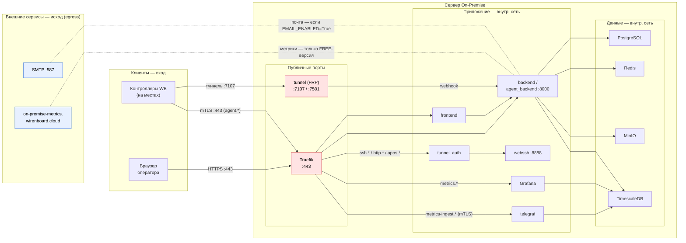

# Сетевая схема и порты (On-Premise)

> 🇬🇧 [English version](./SECURITY_NETWORK_EN.md)

> **Назначение.** Данные для настройки фаервола: какие порты
> открывать, кто и в каком направлении инициирует соединения, какие исходящие
> каналы есть у инсталляции. Сверено с `docker-compose.yml`, `.env.example`,
> `traefik/` и `README(_EN).md` на момент написания (ветка onprem-release/2.0.0).

## 1. Обзор

On-Premise — это облако Wiren Board, развёрнутое на стороне заказчика. Точка входа
веб-трафика — обратный прокси **Traefik**. Отдельно публикуется **порт туннелей**,
через который **контроллеры подключаются к облаку** (исходящее соединение со стороны
контроллера → входящее на облако). Базы, кэш и хранилище наружу не публикуются:
метрики хранятся в TimescaleDB внутри docker-сети, их приём идёт только через
Traefik (443) — `https://metrics-ingest.your-domain.com` (Telegraf, mTLS), а
пользовательские дашборды отдаёт Grafana на `https://metrics.your-domain.com`.

Принципиально: наружу инсталляция публикует **ровно два набора портов** —
веб (443) и туннели (7107, опц. 7501). Всё остальное — внутри docker-сети.

## 2. Таблица портов

| Сервис | Порт (host) | Публичный? | Назначение |
|--------|-------------|-----------|------------|
| **traefik** | `443` (override: `TRAEFIK_EXTERNAL_PORT`) | **да** | Веб-доступ к облаку (HTTPS/TLS), API, фронтенд, agent, приём метрик, ssh/http/apps-прокси к туннелям |
| **tunnel** | `7107` | **да** | Туннели контроллеров (FRP). Контроллеры устанавливают соединение СЮДА |
| **tunnel** | `7501` | да (опц.) | Tunnel dashboard (за Basic Auth, можно не открывать наружу) |
| postgres | — | нет | БД, только внутри docker-сети |
| redis | — | нет | Кэш/брокер, только внутри сети |
| timescale (TimescaleDB) | — | нет | Хранилище метрик контроллеров, только внутри docker-сети; host-порт не публикуется |
| telegraf | — | нет | Приём метрик с контроллеров; доступен через Traefik: `https://metrics-ingest.your-domain.com` (mTLS) |
| clients-grafana (Grafana) | — | нет | Пользовательские дашборды метрик; доступна через Traefik: `https://metrics.your-domain.com` |
| minio | — | нет | Объектное хранилище, только внутри сети |
| backend / agent_backend / tunnel-webhooks-backend | — | нет | API (`:8000`), доступны Traefik'у, tunnel_auth, frontend и tunnel (webhook) |
| webssh | — | нет | SSH-в-браузере (`:8888`), проксируется через tunnel_auth — внутренний сервис авторизации туннельных подключений |
| frontend | — | нет | SPA, доступен только Traefik'у |
| worker / worker-metrics / worker-grafana / worker-email / scheduler | — | нет | Фоновые задачи |

> `TRAEFIK_EXTERNAL_PORT` позволяет увести Traefik на локальный порт (например
> `127.0.0.1:8443`) — это режим «за внешним веб-сервером» (см. §8).

## 3. DNS / сабдомены

Сертификат и DNS должны покрывать (где `your-domain.com` — полный хост облака):

```
your-domain.com            app.your-domain.com              agent.your-domain.com
metrics.your-domain.com    metrics-ingest.your-domain.com   tunnel.your-domain.com
ssh.your-domain.com        http.your-domain.com
*.ssh.your-domain.com      *.http.your-domain.com

apps.your-domain.com       *.apps.your-domain.com           # сервис-туннели контроллеров
```

Wildcard `*.ssh` / `*.http` — это per-controller доступ к туннелированным контроллерам
(каждый контроллер получает свой сабдомен ssh/http через облако). Опциональный
wildcard `*.apps` — сервис-туннели (веб-сервисы контроллеров, например Node-RED):
адреса вида `<серийник>-<порт>.apps.your-domain.com`, тот же порт 443.

## 4. Диаграмма направлений



_Легенда: **красный** — публичные порты (открыты наружу), **синий** — внешние сервисы (исходящие соединения, egress); пунктир — исходящий трафик. **Метрики** уходят к WB только в бесплатной (FREE) версии; **почта** — только при `EMAIL_ENABLED=True` (по умолчанию включена)._

## 5. Кто инициирует соединения

| Канал | Инициатор | Назначение | Порт | Направление |
|-------|-----------|------------|------|-------------|
| Веб-доступ | Браузер оператора | Traefik | 443 | **вход** |
| Агентский API | **Контроллер WB** | Traefik → agent_backend (`agent.your-domain.com`) | 443 | **вход, mTLS** (клиентский сертификат контроллера) |
| Метрики с контроллеров | **Контроллер WB** | Traefik → telegraf (`metrics-ingest.your-domain.com`) | 443 | **вход, mTLS** (только агент ≤ 1.6.14, см. §6) |
| Дашборды метрик | Браузер оператора | Traefik → Grafana (`metrics.your-domain.com`) | 443 | вход |
| Туннели контроллеров | **Контроллер WB** | tunnel (FRP) | 7107 | **вход** (контроллер дозванивается в облако) |
| Tunnel dashboard | Браузер админа | tunnel | 7501 | вход (опц., см. §7) |
| БД / кэш / хранилище / метрики | backend, worker, telegraf, grafana | postgres / redis / minio / timescale | — | внутри сети |
| **Метрики к WB** | backend | `on-premise-metrics.wirenboard.cloud` | 443 | **исход (egress)** — только в бесплатной (FREE) версии |
| Почта | backend | SMTP (`EMAIL_HOST`) | `EMAIL_PORT` (в примере 587) | исход — только при `EMAIL_ENABLED=True` |

## 6. Агентский API, туннели и метрики

**Агентский API (mTLS, порт 443).** Контроллеры обращаются к облаку по HTTPS на
`agent.your-domain.com` (тот же порт 443). Этот endpoint требует **клиентский
TLS-сертификат контроллера** (mTLS): Traefik проверяет его по корневому сертификату
WirenBoard Root CA (`tls.options check-ca`, `clientAuthType =
RequireAndVerifyClientCert` — см. `traefik/traefik-check-ca.toml` и labels сервиса
`agent_backend` в `docker-compose.yml`). Без валидного сертификата контроллера
соединение отклоняется на уровне TLS-рукопожатия.

**Туннели (FRP, порт 7107).** Контроллеры на объектах сами устанавливают исходящее
соединение к облаку на порт 7107 (авторизация по `TUNNEL_AUTH_TOKEN`). Облако затем
даёт доступ к каждому контроллеру через сабдомены `*.ssh.` (SSH-в-браузере, сервис
`webssh`), `*.http.` (веб-интерфейс контроллера) и `*.apps.`
(сервис-туннели: веб-сервисы контроллера, тот же порт 443). То есть **7107 нужно
открыть на вход** со стороны сетей, где стоят контроллеры. 7501 (dashboard) —
опционально (см. §7).

**Метрики к серверу WB (egress).** Инсталляция **обязательно** отправляет
анонимные метрики на наш сервер `https://on-premise-metrics.wirenboard.cloud`
(бесплатная версия до 100 контроллеров). Если этот egress закрыт фаерволом —
облако продолжит работать, но **нельзя будет добавлять новые контроллеры**. Состав
отправляемых метрик виден в административной панели: «On-Premise» → «Metrics». Внутри
метрики контроллеров хранятся в локальном **TimescaleDB** (host-порт не публикуется);
приём метрик с контроллеров выполняет **Telegraf** за Traefik:
`https://metrics-ingest.your-domain.com` (mTLS), а пользовательские дашборды —
**Grafana**: `https://metrics.your-domain.com` (браузер, порт 443).

> ⚠️ Отправка метрик С контроллеров поддерживается только на `wb-cloud-agent` ≤ 1.6.14;
> на новых агентах метрики контроллеров в On-Premise облако не отправляются.

## 7. Правила фаервола (межсетевого экрана, firewall)

### INBOUND — открыть

| Порт | Протокол | Источник | Зачем |
|------|----------|----------|-------|
| **443** | TCP/HTTPS | операторы + сети с контроллерами WB | Веб-доступ к облаку; агентский API `agent.*` (mTLS), приём метрик `metrics-ingest.*` (mTLS) и активационные ссылки для контроллеров; веб-сервисы контроллеров `*.apps.` |
| **7107** | TCP | сети с контроллерами WB | Туннели контроллеров (FRP) |
| 7501 | TCP | админ (опц.) | Tunnel dashboard (за Basic Auth) |

> **Про 7501.** Compose публикует этот порт безусловно и на всех интерфейсах хоста.
> Если dashboard не должен быть доступен извне — закройте порт внешним фаерволом
> или задайте в `.env` `TUNNEL_DASHBOARD_PORT="127.0.0.1:7501"`. Учтите, что docker
> публикует порты в обход ufw.

**НЕ открывать наружу:** порты postgres / redis / timescale / telegraf / grafana /
minio / backend:8000 / webssh:8888 — они только внутри docker-сети.

### OUTBOUND — egress

| Назначение | Хост | Порт | Можно закрыть? |
|------------|------|------|----------------|
| Метрики WB | `on-premise-metrics.wirenboard.cloud` | 443 | Закрытие = нельзя добавлять контроллеры (в бесплатной версии отправка обязательна) |
| Почта | `EMAIL_HOST` (SMTP) | `EMAIL_PORT` (в примере 587) | Да — задайте `EMAIL_ENABLED=False` (приглашения тогда передаются ссылкой из админ-панели) |
| Docker-образы (установка/обновление) | `ghcr.io` + `registry-1.docker.io` / `docker.io` (postgres, redis, timescale, telegraf, grafana, minio, traefik) | 443 | Нужен только на время установки/обновления; в остальное время можно закрыть |
| База геолокации сессий | `download.db-ip.com` | 443 | Да — нужен только при `GEOIP_ENABLED=True` и только в момент загрузки базы (`make run`, `make update-geoip`) |

> **TLS-сертификаты.** Инсталляция сама наружу за сертификатами **не ходит** —
> ACME/Let's Encrypt в стеке нет. Сертификаты (`fullchain.pem` / `privkey.pem`)
> монтируются в Traefik файлами; их получение и обновление выполняет администратор
> вручную (например, certbot с DNS-challenge со своей машины).

## 8. Внешний обратный прокси перед Traefik

Если перед Traefik ставится внешний веб-сервер/прокси (nginx/apache/caddy/Traefik) —
например, по требованию заказчика — он **не должен терминировать TLS**.
Внешний прокси обязан работать в режиме **L4 TCP passthrough** (маршрутизация по SNI
без расшифровки трафика), а TLS завершает только Traefik инсталляции. Причина:
endpoint `agent.your-domain.com` использует mTLS (см. §6) — при L7-терминации TLS на
внешнем прокси клиентский сертификат контроллера до Traefik не доходит, и
аутентификация контроллеров ломается.

- Готовые рецепты — в `README.md` в корне репозитория, раздел «🛡 Использование с внешним
  веб-сервером (Nginx/Apache/Caddy/Traefik)»: кейсы A/B (nginx `stream` +
  `ssl_preread`) и кейс C (внешний Traefik, TCP-роутер с `passthrough: true`).
- При размещении внешнего прокси на том же хосте Traefik инсталляции уводится на
  локальный порт через `TRAEFIK_EXTERNAL_PORT` (например `127.0.0.1:8443`), а внешний
  прокси пробрасывает TCP на него.
- Порт 7107 (туннели) остаётся прямым L4-соединением до сервера (FRP — не HTTP,
  через HTTP-прокси не проксируется).
