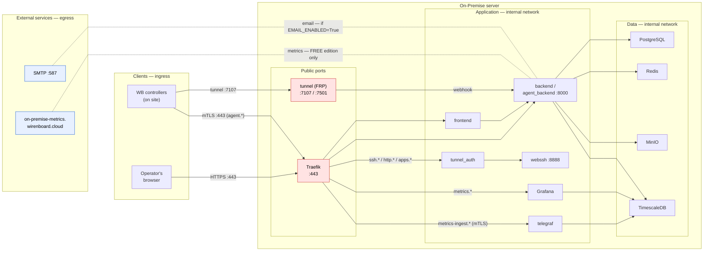

# Network Map and Ports (On-Premise)

> 🇷🇺 [Русская версия](./SECURITY_NETWORK.md)

> **Purpose.** Input for firewall configuration: which ports to open, who
> initiates connections and in which direction, and what outbound (egress)
> channels the installation has. Verified against `docker-compose.yml`,
> `.env.example`, `traefik/` and `README(_EN).md` from the same repository
> revision.

## 1. Overview

On-Premise is the Wiren Board cloud deployed on the customer's side. The entry
point for web traffic is the **Traefik** reverse proxy. The **tunnel port** is
published separately — **controllers connect to the cloud** through it (outbound
connection from the controller → inbound on the cloud). Databases, cache and
object storage are not exposed: metrics are stored in TimescaleDB inside the
docker network, ingest goes only through Traefik (443) —
`https://metrics-ingest.your-domain.com` (Telegraf, mTLS) — and user dashboards
are served by Grafana at `https://metrics.your-domain.com`.

The key point: the installation exposes **exactly two sets of ports** — web (443)
and tunnels (7107, optionally 7501). Everything else stays inside the docker
network.

## 2. Port table

| Service | Port (host) | Public? | Purpose |
|---------|-------------|---------|---------|
| **traefik** | `443` (override: `TRAEFIK_EXTERNAL_PORT`) | **yes** | Web access to the cloud (HTTPS/TLS), API, frontend, agent, metrics ingest, ssh/http/apps proxying to tunnels |
| **tunnel** | `7107` | **yes** | Controller tunnels (FRP). Controllers establish connections TO this port |
| **tunnel** | `7501` | yes (opt.) | Tunnel dashboard (behind Basic Auth, can stay closed to the outside) |
| postgres | — | no | Database, docker network only |
| redis | — | no | Cache/broker, internal network only |
| timescale (TimescaleDB) | — | no | Controller metrics storage, docker network only; no host port published |
| telegraf | — | no | Controller metrics ingest; reachable through Traefik: `https://metrics-ingest.your-domain.com` (mTLS) |
| clients-grafana (Grafana) | — | no | User metrics dashboards; reachable through Traefik: `https://metrics.your-domain.com` |
| minio | — | no | Object storage, internal network only |
| backend / agent_backend / tunnel-webhooks-backend | — | no | API (`:8000`), reachable by Traefik, tunnel_auth, frontend and tunnel (webhook) |
| webssh | — | no | SSH-in-browser (`:8888`), proxied through tunnel_auth — the internal tunnel-connection authorization service |
| frontend | — | no | SPA, reachable by Traefik only |
| worker / worker-metrics / worker-grafana / worker-email / scheduler | — | no | Background tasks |

> `TRAEFIK_EXTERNAL_PORT` lets you move Traefik to a local port (e.g.
> `127.0.0.1:8443`) — the "behind an external web server" mode (see §8).

## 3. DNS / subdomains

The certificate and DNS must cover (where `your-domain.com` is the full cloud host):

```
your-domain.com            app.your-domain.com              agent.your-domain.com
metrics.your-domain.com    metrics-ingest.your-domain.com   tunnel.your-domain.com
ssh.your-domain.com        http.your-domain.com
*.ssh.your-domain.com      *.http.your-domain.com

apps.your-domain.com       *.apps.your-domain.com           # controller web services
```

Wildcards `*.ssh` / `*.http` provide per-controller access to tunneled
controllers (each controller gets its own ssh/http subdomain through the cloud).
The `*.apps` wildcard is for service tunnels (controller web services,
e.g. Node-RED): addresses of the form
`<serial>-<port>.apps.your-domain.com`, same port 443.

## 4. Connection direction diagram



_Legend: **red** — public ports (open to the outside), **blue** — external
services (outbound connections, egress); dotted lines — outbound traffic.
**Metrics** are sent to WB only in the free (FREE) edition; **email** — only
when `EMAIL_ENABLED=True` (enabled by default)._

## 5. Who initiates connections

| Channel | Initiator | Target | Port | Direction |
|---------|-----------|--------|------|-----------|
| Web access | Operator's browser | Traefik | 443 | **inbound** |
| Agent API | **WB controller** | Traefik → agent_backend (`agent.your-domain.com`) | 443 | **inbound, mTLS** (controller client certificate) |
| Controller metrics | **WB controller** | Traefik → telegraf (`metrics-ingest.your-domain.com`) | 443 | **inbound, mTLS** (agent ≤ 1.6.14 only, see §6) |
| Metrics dashboards | Operator's browser | Traefik → Grafana (`metrics.your-domain.com`) | 443 | inbound |
| Controller tunnels | **WB controller** | tunnel (FRP) | 7107 | **inbound** (the controller dials in to the cloud) |
| Tunnel dashboard | Admin's browser | tunnel | 7501 | inbound (opt., see §7) |
| DB / cache / storage / metrics | backend, worker, telegraf, grafana | postgres / redis / minio / timescale | — | internal network |
| **Metrics to WB** | backend | `on-premise-metrics.wirenboard.cloud` | 443 | **outbound (egress)** — free (FREE) edition only |
| Email | backend | SMTP (`EMAIL_HOST`) | `EMAIL_PORT` (587 in the example) | outbound — only when `EMAIL_ENABLED=True` |

## 6. Agent API, tunnels and metrics

**Agent API (mTLS, port 443).** Controllers reach the cloud over HTTPS at
`agent.your-domain.com` (same port 443). This endpoint requires the
**controller's client TLS certificate** (mTLS): Traefik validates it against the
WirenBoard Root CA (`tls.options check-ca`, `clientAuthType =
RequireAndVerifyClientCert` — see `traefik/traefik-check-ca.toml` and the
`agent_backend` service labels in `docker-compose.yml`). Without a valid
controller certificate the connection is rejected during the TLS handshake.

**Tunnels (FRP, port 7107).** Controllers on site establish an outbound
connection to the cloud on port 7107 themselves (authorization via
`TUNNEL_AUTH_TOKEN`). The cloud then provides access to each controller through
the `*.ssh.` (SSH-in-browser, the `webssh` service), `*.http.` (controller
web UI) and `*.apps.` (service tunnels: controller web services,
same port 443) subdomains. In other words, **7107 must be open for inbound
traffic** from the networks where controllers are located. 7501 (dashboard) is
optional (see §7).

**Metrics to the WB server (egress).** The installation **must** send anonymous
metrics to our server `https://on-premise-metrics.wirenboard.cloud` (free
edition, up to 100 controllers). If this egress is blocked by a firewall, the
cloud keeps working but **new controllers cannot be added**. The exact set of
metrics being sent is visible in the admin panel: "On-Premise" → "Metrics".
Internally, controller metrics are stored in the local **TimescaleDB** (no host
port published); controllers deliver metrics to **Telegraf** behind Traefik:
`https://metrics-ingest.your-domain.com` (mTLS), and user dashboards are served
by **Grafana**: `https://metrics.your-domain.com` (browser, port 443).

> ⚠️ Sending metrics FROM controllers is supported only with `wb-cloud-agent`
> ≤ 1.6.14; newer agents do not send controller metrics to the On-Premise cloud.

## 7. Firewall rules

### INBOUND — open

| Port | Protocol | Source | Why |
|------|----------|--------|-----|
| **443** | TCP/HTTPS | operators + networks with WB controllers | Web access to the cloud; agent API `agent.*` (mTLS), metrics ingest `metrics-ingest.*` (mTLS) and controller activation links; controller web services `*.apps.` |
| **7107** | TCP | networks with WB controllers | Controller tunnels (FRP) |
| 7501 | TCP | admin (opt.) | Tunnel dashboard (behind Basic Auth) |

> **About 7501.** Compose publishes this port unconditionally on all host
> interfaces. If the dashboard must not be reachable from the outside, block the
> port with an external firewall or set `TUNNEL_DASHBOARD_PORT="127.0.0.1:7501"`
> in `.env`. Keep in mind that docker publishes ports bypassing ufw.

**Do NOT expose:** the postgres / redis / timescale / telegraf / grafana /
minio / backend:8000 / webssh:8888 ports — they exist only inside the docker
network.

### OUTBOUND — egress

| Destination | Host | Port | Can it be blocked? |
|-------------|------|------|--------------------|
| WB metrics | `on-premise-metrics.wirenboard.cloud` | 443 | Blocking = new controllers cannot be added (sending is mandatory in the free edition) |
| Email | `EMAIL_HOST` (SMTP) | `EMAIL_PORT` (587 in the example) | Yes — set `EMAIL_ENABLED=False` (invitations are then shared as links from the admin panel) |
| Docker images (install/upgrade) | `ghcr.io` + `registry-1.docker.io` / `docker.io` (postgres, redis, timescale, telegraf, grafana, minio, traefik) | 443 | Needed only during install/upgrade; can stay blocked the rest of the time |
| Session geolocation database | `download.db-ip.com` | 443 | Yes — needed only with `GEOIP_ENABLED=True`, and only while the database downloads (`make run`, `make update-geoip`) |

> **TLS certificates.** The installation does **not** fetch certificates from
> the outside — there is no ACME/Let's Encrypt in the stack. The certificates
> (`fullchain.pem` / `privkey.pem`) are mounted into Traefik as files; obtaining
> and renewing them is done by the administrator manually (e.g. certbot with a
> DNS challenge from their own machine).

## 8. External reverse proxy in front of Traefik

If an external web server/proxy (nginx/apache/caddy/Traefik) is placed in front
of Traefik — e.g. per customer requirements — it **must not terminate TLS**. The
external proxy must operate in **L4 TCP passthrough** mode (SNI-based routing
without decrypting traffic), with TLS terminated only by the installation's
Traefik. Reason: the `agent.your-domain.com` endpoint uses mTLS (see §6) — with
L7 TLS termination on the external proxy the controller's client certificate
never reaches Traefik, breaking controller authentication.

- Ready-made recipes are in this directory's `README.md`, section "🛡 Using an
  external web server (Nginx/Apache/Caddy/Traefik)": cases A/B (nginx `stream` +
  `ssl_preread`) and case C (external Traefik, TCP router with
  `passthrough: true`).
- When the external proxy runs on the same host, move the installation's Traefik
  to a local port via `TRAEFIK_EXTERNAL_PORT` (e.g. `127.0.0.1:8443`) and forward
  TCP to it from the external proxy.
- Port 7107 (tunnels) remains a direct L4 connection to the server (FRP is not
  HTTP and cannot be proxied through an HTTP proxy).
